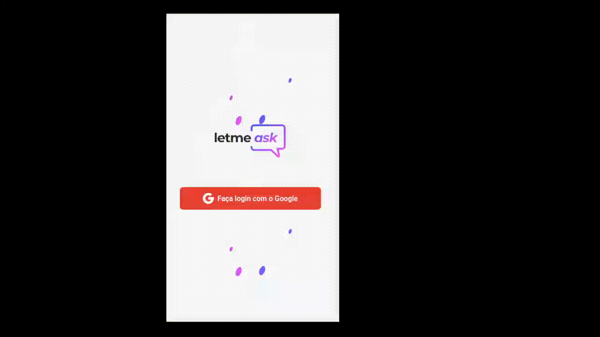

<h1 align="center">
    LetMeSay
</h1>

<br>

## 💻 Desktop


---
<br>

## 📱 Mobile 



## 🧪 Tecnologias

Esse projeto foi desenvolvido com as seguintes tecnologias:

- [React](https://reactjs.org)
- [React-Redux](https://react-redux.js.org/)
- [Firebase](https://firebase.google.com/)
- [Eslint](https://eslint.org/)
- [Sass](https://sass-lang.com/)

---

<br>

## 🚀 Como visualizar

Acesse este [link](https://let-me-say.firebaseapp.com/) para poder visualizar o projeto.

Lembrando que será necessário ter uma conta no [Gmail](https://mail.google.com/).

<br>

---
<br>

## 🚀 Como executar

Clone o projeto e acesse a pasta do mesmo.

```bash
$ git clone https://github.com/ronald-assis/let-me-say/
$ cd let-me-say
```

Para iniciá-lo, siga os passos abaixo:
```bash
# Instalar as dependências
$ npm install

# Iniciar o projeto
$ npm start
```
O app estará disponível no seu browser pelo endereço http://localhost:3000.

Será necessário criar uma conta no [Firebase](https://firebase.google.com/) e um projeto para disponibilizar um Realtime Database.

---
<br>

## 💻 Projeto

Letmesay é perfeito para pessoas poderem falar esta seu dia, de uma forma muito organizada e democrática, caso querira acessar por um dispositivo mobile você também pode.